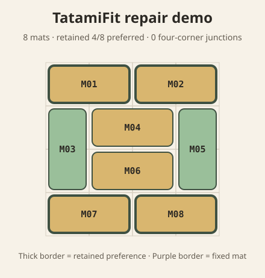

# TatamiFit

**Repair a tatami-style room without creating four-mat cross joints.**

[](https://github.com/KanadeK/tatamifit/actions/workflows/ci.yml)
[](https://github.com/KanadeK/tatamifit/releases/latest)
[](https://www.python.org/)
[](LICENSE)

TatamiFit is a zero-runtime-dependency, offline CLI. Give it a rectangular grid,
blocked cells, mats that must stay, and an optional existing layout you would like to
retain. It performs an exact search and produces a complete layout in which no point is
the meeting place of four different mats.



It is a real constraint solver, not a pattern mockup or a claim about every traditional
installation rule. The output is an abstract 1-by-2 grid plan you can inspect in JSON,
standalone SVG, or plain text.

## Who it is for

- makers prototyping modular 1-by-2 floor-mat layouts;
- interior-design students checking the no-four-corners rule;
- renovators asking how much of an existing grid layout can remain unchanged;
- puzzle and combinatorics users who need a strict, scriptable room-layout check.

## Install

Python 3.11 or newer is required. Install the verified v0.1.0 wheel directly from its
GitHub Release:

```console
python -m pip install https://github.com/KanadeK/tatamifit/releases/download/v0.1.0/tatamifit-0.1.0-py3-none-any.whl
```

TatamiFit has no runtime packages, account, network request, telemetry, or native binary
dependency.

## 60-second quick start

```console
tatamifit demo --out demo
```

Expected result:

```text
LAYOUT TatamiFit repair demo: 8 mats, retained 4/8 preferred placements.
JSON: demo/layout.json
SVG:  demo/layout.svg
TEXT: demo/layout.txt
```

Open `demo/layout.svg`, or inspect `demo/layout.txt` in any terminal. The demo starts
from eight horizontal preferred placements. Keeping all eight would create cross joints;
the exact solver retains the maximum four and replaces four.

## Plan your own room

Copy [`examples/repair-room.json`](examples/repair-room.json) and edit the grid:

```json
{
  "schema_version": 1,
  "name": "Eight-mat studio repair",
  "width": 4,
  "height": 4,
  "blocked": [],
  "fixed": [
    {"x": 0, "y": 0, "orientation": "horizontal"}
  ],
  "preferred": [
    {"x": 0, "y": 0, "orientation": "horizontal"},
    {"x": 2, "y": 0, "orientation": "horizontal"}
  ]
}
```

Then run:

```console
tatamifit plan room.json --out plan
```

Coordinates are zero-based. A `horizontal` mat covers `(x,y)` and `(x+1,y)`; a
`vertical` mat covers `(x,y)` and `(x,y+1)`.

- `blocked` cells are outside the usable floor.
- `fixed` mats are hard constraints and are never silently moved.
- `preferred` mats describe an existing or desired layout. They are soft: TatamiFit
  retains the largest possible number, then uses a stable deterministic tie-break.
- Unknown keys fail so a typo such as `heigth` cannot silently change the room.

## Outputs

TatamiFit writes the requested directory only after a complete layout and all three
artifacts have been produced:

| File | Purpose |
| --- | --- |
| `layout.json` | Stable v1 machine contract, placements, cells, fixed/retained flags, and search evidence |
| `layout.svg` | Standalone visual plan with mat IDs and retained/fixed borders |
| `layout.txt` | Portable grid, summary, rule result, and placement list |

The same mat IDs and placements appear in every format. TatamiFit never overwrites an
existing output path; choose a new `--out` directory for each run.

## Success, boundary, and failure examples

From a source checkout:

```console
uv sync --locked --all-groups
uv run --no-sync tatamifit plan examples/repair-room.json --out build/repair
uv run --no-sync tatamifit plan examples/narrow-room.json --out build/narrow
uv run --no-sync tatamifit plan examples/no-layout.json --out build/no-layout
uv run --no-sync tatamifit plan examples/invalid-fixed-overlap.json --out build/invalid
```

| Example | Exit | Evidence |
| --- | ---: | --- |
| `repair-room.json` | 0 | Eight-mat layout, one fixed mat, maximum preferred retention |
| `narrow-room.json` | 0 | Boundary-shaped 1-by-8 room with four vertical mats |
| `no-layout.json` | 1 | Valid even-area input, but two usable cells are disconnected |
| `invalid-fixed-overlap.json` | 2 | Invalid hard constraints with exact overlap path and repair |

No output directory is created for exit 1 or 2.

## Commands and exit codes

```text
tatamifit plan ROOM.json --out NEW_DIRECTORY
tatamifit demo --out NEW_DIRECTORY
tatamifit --version
```

- `0`: a complete layout was found and all artifacts were written.
- `1`: the room contract is valid, but no layout satisfies its hard constraints.
- `2`: malformed input, unsupported boundary, I/O problem, existing output path, or CLI
  usage error.

Errors include a stable code and a concrete `Repair:` line. For example:

```text
NO LAYOUT [NO_LAYOUT] Valid room 'Disconnected corners' has no complete layout under its blocked cells, fixed mats, and the no-four-corners rule.
Repair: Remove or rotate a fixed mat, unblock or reshape isolated cells, then rerun.
```

## How it works

TatamiFit validates the complete JSON boundary, places hard mats, then searches domino
placements from the most constrained uncovered cell. It rejects a branch as soon as a
covered vertex has four distinct mat owners. Preferred placements are tried first, and
an optimistic retention bound prunes branches that cannot beat the best repair found.

The grid is capped at 64 usable cells. This keeps the exact result and its operating
boundary honest instead of hiding a heuristic timeout.

## Known limitations

- v0.1 models equal grid cells and full 1-by-2 mats only; it has no half mats, custom
  dimensions, cutting, price, material, substrate, moisture, or doorway model.
- The only cultural/layout rule claimed is “no four different mats meet at one point.”
  Regional, ceremonial, tea-room, and installer rules are not classified.
- Width and height are each at most 20, with at most 64 usable cells.
- A preferred placement is retained only when its exact anchor and orientation remain.
- The output is planning evidence, not a professional installation, accessibility,
  structural, or safety guarantee.

## Troubleshooting

**`ERROR [ODD_USABLE_AREA]`**
Block or unblock one cell so 1-by-2 mats have an even number of usable cells.

**`ERROR [FIXED_MATS_OVERLAP]`**
Move or remove the indexed fixed mat. Fixed mats are hard and are never relaxed.

**`NO LAYOUT [NO_LAYOUT]`**
The JSON is valid, but its usable shape, fixed mats, and junction rule cannot all hold.
Inspect isolated cells, then remove/rotate one fixed mat or change the blocked shape.

**`ERROR [OUTPUT_EXISTS]`**
Choose a new `--out` path. TatamiFit preserves every existing file and directory.

**`ERROR [INVALID_JSON] ... line ... column ...`**
Correct the reported JSON syntax and save the file as UTF-8.

## Development

```console
git clone https://github.com/KanadeK/tatamifit.git
cd tatamifit
uv sync --locked --all-groups
uv run --no-sync python scripts/check.py
```

The last command is the single local, CI, and release gate. It checks formatting, lint,
strict types, branch-covered unit/integration tests, success/boundary/failure examples,
deterministic committed demo output, wheel/sdist builds, a fresh virtual environment,
and the installed console entry point.

See [the v0.1 specification](docs/spec.md), [selection research](docs/research.md), and
[contribution guide](CONTRIBUTING.md).

## License

[MIT](LICENSE) © 2026 KanadeK.
